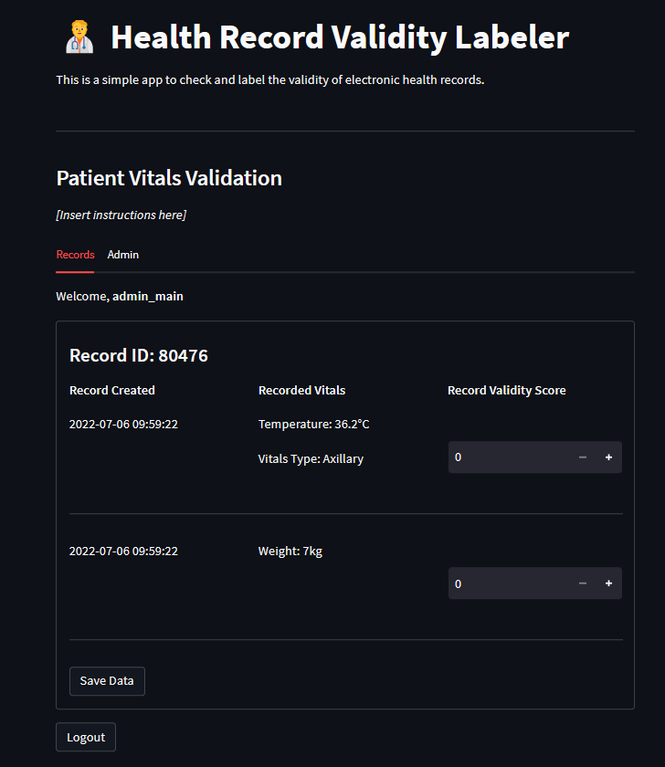

# Data Validator

This project is a web-based data validator tool. It allows users to validate data records through a published web application that can be accessed by expert validators from anywhere in the world.

## Set up

Create a Python environment and install the dependencies:

```bash
pip install -r requirements.txt
```

## The database

The database is a No-SQL database, based on [Deta](https://deta.space). It is a key-value storage, where the key is the Record ID, and the values are the recorded data.

The schema of the data is decided by the user and can include any number of fields. The only requirement is that the Record ID is unique as this will be used as the key in the database.

We intend to update the database by adding a validity field where multiple users can submit a score for the validity of the record.

The following is an example of an entry in the database:

```json
{
 "key": "10806",
 "body_position": "",
 "datetime_record_created": "2022-06-23 09:18:09",
 "datetime_record_deleted": "",
 "expert_validity": [
  {
   "created_at": "2023-06-07 23:38:53",
   "expert_id": "user_admin_main",
   "score": 5
  }
 ],
 "loinc_code": "3141-9",
 "patient_id": 79829,
 "record_created_by": 195,
 "record_id": 10806,
 "record_updated_by": "",
 "record_validation_updated": "2023-06-07 19:58:16.979904",
 "record_validity": 1,
 "timestamp": 1655972274,
 "unit": "kg",
 "user_type": "Nurse",
 "vitals": "Weight",
 "vitals_reading": 6.8,
 "vitals_type": ""
}
```

The above sample will then be displayed in the application such that the user can add a score or value to the `expert_validity` field.

### Data Record Schema

The data record schema is generally source agnostic and can be used to describe any data record as long as it can be parsed into a json format. Generally, `XXXX_id` are the keys in json records and `name` or `header` determines the display text used in the application.
The data record should have three parts:

- App info: This is used to specify information about the app. It includes fields such as `title` and `description`. Other fields will be described in the section below.
  
  ```json
  ...
  "app_info": {
    "title": "Health Record Validity Labeler",
    "icon": ":health_worker:",
    "description": "This is a simple app to check and label the validity of electronic health records.",
    "subtitle": "Patient Vitals Validation",
    "subtitle_description": "*[Insert instructions here]*"
  },
  ...
  ```

- Record: This is used to specify the data record, and how the record will be viewed in the application. An example is shown below:

  ```json
  ...
  "record": {
    "type": "display",
    "record_id": "patients_ids",
    "query_id": "patient_id",
    "blocks": [
      {
        "type": "display",
        "header": "Record Created",
        "fields": [
          {
            "id": "datetime_record_created",
            "type": "str"
          }
        ]
      },
      {
        "type": "display",
        "header": "Recorded Vitals",
        "fields": [
          {
            "name": "Vital",
            "id": "vitals_reading",
            "type": "number",
            "prefix": { "source": "record", "value": "vitals" },
            "suffix": { "source": "record", "value": "unit" }
          },
          {
            "name": "Body Position",
            "id": "body_position",
            "type": "str"
          },
          {
            "name": "Vitals Type",
            "id": "vitals_type",
            "type": "str",
            "prefix": { "source": "config", "value": "Vitals Type" }
          }
        ]
      }
    ]
  },
  ...
  ```

- Validity: This is used to specify how the record is validated. An example is shown below:

```json
{
  "expert_validity": [
    {
      "expert_id": "int",
      "score": "int",
      "created_at": "datetime"
    },
    ...
  ]
}
```

The full schema config is shown below:

```json
{
  "app_info": {
    "title": "Health Record Validity Labeler",
    "icon": ":health_worker:",
    "description": "This is a simple app to check and label the validity of electronic health records.",
    "subtitle": "Patient Vitals Validation",
    "subtitle_description": "*[Insert instructions here]*"
  },
  "record": {
    "type": "display",
    "record_id": "patients_ids",
    "query_id": "patient_id",
    "blocks": [
      {
        "type": "display",
        "header": "Record Created",
        "fields": [
          {
            "id": "datetime_record_created",
            "type": "str"
          }
        ]
      },
      {
        "type": "display",
        "header": "Recorded Vitals",
        "fields": [
          {
            "name": "Vital",
            "id": "vitals_reading",
            "type": "number",
            "prefix": { "source": "record", "value": "vitals" },
            "suffix": { "source": "record", "value": "unit" }
          },
          {
            "name": "Body Position",
            "id": "body_position",
            "type": "str"
          },
          {
            "name": "Vitals Type",
            "id": "vitals_type",
            "type": "str",
            "prefix": { "source": "config", "value": "Vitals Type" }
          }
        ]
      }
    ]
  },
  "validity": {
    "type": "input",
    "fields": [
      {
        "type": "number",
        "name": "Record Validity Score",
        "id": "expert_validity",
        "min": 0,
        "max": 5
      }
    ]
  }
}
```

This is translated to the following display:


## Usage

- Provide a `.env` file where the environment variables are located.
- The `DETA_KEY` is the API key for the storage in [Deta space](https://deta.space). It is needed to access the cloud-based database. See the [src/backend/database.py](src/backend/database.py) file for more details on the simple interface to the database.
- Use the following in the `.env` file:
- Save your schema config into the [configs/schema.json](configs/schema.json) file.

```bash
DETA_KEY=c0wu41vosct_5SUqzfTVqfdjNc4wcWGNeNYZWHDBGu4Y
```

> Note that the above key will be replaced in production. It should be used only for testing purposes.

- Start the app with:

```bash
streamlit run main.py
```

## TODOs

- [ ] Comprehensive documentation
- [ ] List all available users in the admin section. This will allow for better user management.
- [ ] Add an analysis section to give a summary of validated data and the general validation progress
- [ ] Add varieties of validation types for the experts such as text options, remarks, etc.
- [ ] Ensure that no repeat validation for the same user
- [ ] Admin data management: Data correction, deletion, etc.
